# CODEBASE_MAP.md — MoMo Overseer

> **Last synced:** 2026-04-03T13:40:00Z (Native Windows execution patched for RUN/OPTIMIZE tools)
> **Architecture:** Headless CLI daemon + MCP server for autonomous Jules swarm orchestration

## System Architecture

```mermaid
graph TB
    subgraph "CLI Entrypoint"
        CLI["src/cli.ts<br/>Commander CLI"]
    end

    subgraph "MCP Server"
        MCP["src/mcp_server.ts<br/>stdio MCP Server"]
    end

    subgraph "Core AI Engine"
        ORCH["src/momoa_core/orchestrator.ts<br/>Headless Orchestrator (1132 LOC)"]
        OVER["src/momoa_core/overseer.ts<br/>Autonomous Overseer (283 LOC)"]
        WP["src/momoa_core/workPhase.ts<br/>Work Phase Manager"]
        TYPES["src/momoa_core/types.ts<br/>Core Type Definitions"]
    end

    subgraph "Swarm Management"
        SM["src/swarm/swarm_manager.ts<br/>Jules Worker Dispatch"]
        SP["src/swarm/session_poller.ts<br/>Jules API Poller"]
        RW["src/swarm/report_writer.ts<br/>Status Report Generator"]
        ST["src/swarm/types.ts<br/>Swarm Types"]
    end

    subgraph "Services"
        GC["src/services/geminiClient.ts<br/>Gemini API Client (823 LOC)"]
        TM["src/services/transcriptManager.ts<br/>Conversation History"]
        PM["src/services/promptManager.ts<br/>Prompt/Asset Loader"]
        APM["src/services/apiPolicyManager.ts<br/>Rate Limiting"]
        INF["src/services/infrastructure.ts<br/>InfrastructureContext Impl"]
    end

    subgraph "Tool Implementations"
        TR["src/tools/multiAgentToolRegistry.ts<br/>Tool Registry (15 tools)"]
        direction LR
        T1["fileReaderTool"] --> TR
        T2["smartFileEditorTool"] --> TR
        T3["fileSearchTool"] --> TR
        T4["codeRunnerTool"] --> TR
        T5["FactFinderTool"] --> TR
    end

    subgraph "Persistence"
        LS["src/persistence/local_store.ts<br/>Local FS (.swarm/)"]
    end

    CLI --> MCP
    CLI --> SM
    MCP --> TR
    ORCH --> GC
    ORCH --> TM
    ORCH --> TR
    ORCH --> OVER
    SM --> SP
    SP --> RW
    SP --> LS
    SM --> LS
    GC --> APM
```

## Critical Function Map

| Component | Function/Class | File | Line (Approx) | Notes |
|---|---|---|---|---|
| **CLI** | `program.parse()` | `src/cli.ts` | 1 | Main entry, Commander-based |
| **MCP** | `startMcpServer()` | `src/mcp_server.ts` | 125 | Starts stdio MCP server |
| **MCP** | `createMcpServer()` | `src/mcp_server.ts` | 68 | Registers all tools as MCP tools |
| **MCP** | `buildLocalContext()` | `src/mcp_server.ts` | 25 | Creates MultiAgentToolContext |
| **Orchestrator** | `Orchestrator.run()` | `src/momoa_core/orchestrator.ts` | ~200 | Main agentic loop |
| **Orchestrator** | `FORCE_NO_HITL` | `src/momoa_core/orchestrator.ts` | 49 | **Set to `true`** — headless mode |
| **Orchestrator** | `emergencyShutdown()` | `src/momoa_core/orchestrator.ts` | ~1050 | Cleanup Jules branches |
| **Overseer** | `_performReview()` | `src/momoa_core/overseer.ts` | ~150 | AI-driven worklog review |
| **Swarm** | `SwarmManager.dispatch()` | `src/swarm/swarm_manager.ts` | 30 | Dispatch N agents |
| **Swarm** | `SessionPoller.startPolling()` | `src/swarm/session_poller.ts` | ~180 | Polling daemon loop |
| **Swarm** | `SessionPoller.approveWaiting()` | `src/swarm/session_poller.ts` | ~110 | Auto-approve plans |
| **Swarm** | `SessionPoller.pullCompleted()` | `src/swarm/session_poller.ts` | ~140 | Pull completed diffs |
| **Swarm** | `generateStatusReport()` | `src/swarm/report_writer.ts` | 18 | Markdown report gen |
| **Persistence** | `LocalStore` | `src/persistence/local_store.ts` | 22 | FS-based session/log storage |
| **Tools** | `executeTool()` | `src/tools/multiAgentToolRegistry.ts` | 77 | Tool dispatch |
| **Tools** | `registerTool()` | `src/tools/multiAgentToolRegistry.ts` | 44 | Tool registration |
| **Services** | `GeminiClient` | `src/services/geminiClient.ts` | 54 | Gemini API w/ policy |
| **Services** | `TranscriptManager` | `src/services/transcriptManager.ts` | 48 | Conversation mgmt |
| **Services** | `ApiPolicyManager` | `src/services/apiPolicyManager.ts` | 19 | Rate limiting |

## Zombie Code List 🧟

| File | Status | Notes |
|---|---|---|
| `web/` | **DELETED** | Entire React/Vite frontend removed |
| `src/firebase_server.ts` | **DELETED** | Firebase RTDB integration (887 LOC) |
| `src/websocket_server.ts` | **DELETED** | WebSocket server (412 LOC) |
| `src/index.ts` | **DELETED** | Old Express entrypoint |
| `.dockerignore` | **DELETED** | Docker config |
| `src/shared/model.ts` (Firebase paths) | **PURGED** | SESSION_ROOT_PATH, USERINFO_ROOT_PATH, etc. |
| `src/shared/model.ts` (HistoryItem) | **PURGED** | Firebase-specific interface |
| `src/shared/model.ts` (FileChunkData) | **PURGED** | WebSocket-specific |

## "Don't Break This" List 🛑

| Component | Constraint | Reason |
|---|---|---|
| `FORCE_NO_HITL = true` | Do NOT set to `false` | Headless mode; reverting causes daemon hang |
| `orchestrator.ts` tool invocation loop | Preserve EXACTLY | Core AI loop; subtle ordering matters |
| `overseer.ts` _performReview | Keep Gemini JSON parse | AI review feedback pipeline |
| `emergencyShutdown()` | Must clean Jules branches | Prevents orphaned scratchpad branches |
| Tool registry module init (lines 119-135) | Registration order matters | Tools registered at module load |
| `sendMessage` in MCP context | Write to `stderr` only | `stdout` is reserved for MCP protocol |

## Maintenance Scripts 🛠️

| Script | Purpose | Status |
|---|---|---|
| `swarm_overseer.ps1` | Legacy PowerShell swarm monitor | **SUPERSEDED** by `SessionPoller` |
| `dispatch_swarm.ps1` | Legacy PowerShell dispatch | **SUPERSEDED** by `SwarmManager` |
| `approve_stalled.ps1` | Legacy batch approval | **SUPERSEDED** by `approveWaiting()` |
| `triage_225.ps1` | Legacy triage loop | **SUPERSEDED** by `swarm triage` CLI |
| `triage_daemon.ps1` | Legacy triage daemon | **SUPERSEDED** by `swarm monitor` CLI |
| `generate_225_swarms.ps1` | Legacy batch gen | **SUPERSEDED** by `swarm generate-batch` |
| `deploy_swarms.ps1` | Legacy deploy | **SUPERSEDED** by `swarm dispatch` |
