# CODEBASE_MAP.md — MoMo Overseer

> **Last synced:** 2026-04-06T15:15:00Z (Phase 4.1: Swarm Stabilization, Test Harness Integrity & Race Condition Fixes)
> **Architecture:** Headless CLI daemon + Dynamic MCP orchestrator + self-healing execution engine + swarm validation suite

## System Architecture

```mermaid
graph TB
    subgraph "CLI Entrypoint"
        CLI["src/cli.ts<br/>Commander CLI<br/>--mcp-config, --no-self-healing"]
    end

    subgraph "MCP Server (Bi-Directional)"
        MCP["src/mcp_server.ts<br/>stdio MCP Server v2.0<br/>Resources + Prompts endpoints"]
    end

    subgraph "Dynamic MCP Client"
        MCM["src/mcp/mcpClientManager.ts<br/>Connection Pool + Hot-Reload"]
        CFG["mcp_servers.json<br/>Claude Desktop schema"]
        CFG -->|fs.watch| MCM
        MCM -->|tools/list, tools/call| EXT1["External MCP Server 1"]
        MCM -->|resources/read| EXT2["External MCP Server N"]
    end

    subgraph "Self-Healing Engine"
        SHR["src/mcp/selfHealingRunner.ts<br/>Autonomous Fix-and-Retry"]
        SHR -->|sequential-thinking| MCM
    end

    subgraph "Core AI Engine"
        ORCH["src/momoa_core/orchestrator.ts<br/>Headless Orchestrator (~1145 LOC)"]
        OVER["src/momoa_core/overseer.ts<br/>Autonomous Overseer (283 LOC)"]
        WP["src/momoa_core/workPhase.ts<br/>Work Phase Manager"]
        TYPES["src/momoa_core/types.ts<br/>Core Types + McpClientManager ref"]
    end

    subgraph "Swarm Management"
        SM["src/swarm/swarm_manager.ts<br/>Jules Worker Dispatch"]
        SP["src/swarm/session_poller.ts<br/>Jules API Poller"]
        RW["src/swarm/report_writer.ts<br/>Status Report Generator"]
        ST["src/swarm/types.ts<br/>Swarm Types"]
    end

    subgraph "Services"
        GC["src/services/geminiClient.ts<br/>Gemini API Client (823 LOC)"]
        TM["src/services/transcriptManager.ts<br/>Conversation History"]
        PM["src/services/promptManager.ts<br/>Prompt/Asset Loader"]
        APM["src/services/apiPolicyManager.ts<br/>Rate Limiting"]
        INF["src/services/infrastructure.ts<br/>InfrastructureContext Impl"]
    end

    subgraph "Tool Implementations"
        TR["src/tools/multiAgentToolRegistry.ts<br/>Dynamic Tool Registry"]
        direction LR
        T1["fileReaderTool"] --> TR
        T2["smartFileEditorTool"] --> TR
        T3["fileSearchTool (git grep)"] --> TR
        T4["codeRunnerTool"] --> TR
        T5["dynamicMcpTool"] --> TR
        T6["readMcpResourceTool"] --> TR
        T7["getMcpPromptTool"] --> TR
    end

    subgraph "Persistence"
        LS["src/persistence/local_store.ts<br/>Local FS (.swarm/)"]
    end

    CLI --> MCP
    CLI --> SM
    MCP -->|initFromConfig| MCM
    MCP --> TR
    TR -->|registerDynamicMcpTools| MCM
    ORCH --> GC
    ORCH --> TM
    ORCH -->|executeWithHealing| SHR
    SHR --> TR
    ORCH --> OVER
    SM --> SP
    SP --> RW
    SP --> LS
    SM --> LS
    GC --> APM

    subgraph "Validation Suites"
        TA["test_mega_context.ts<br/>55k-line Needle-in-Haystack"]
        TB["test_background_tasks.ts<br/>Non-Blocking Async Jobs"]
        TC["test_jules_validation.ts<br/>Agent→Jules→Report Pipeline"]
        TE["test_antigravity_e2e.ts<br/>Full Swarm Lifecycle"]
        TP3["Phase 3: mcp_validation/<br/>90/90 MCP assertions"]
    end

    TE --> SM
    TE --> RW
    TE --> LS
    TP3 --> MCM
    TP3 --> SHR
    TP3 --> MCP
```

## Critical Function Map

| Component | Function/Class | File | Line (Approx) | Notes |
|---|---|---|---|---|
| **CLI** | `program.parse()` | `src/cli.ts` | 1 | Main entry, Commander-based |
| **CLI** | `--mcp-config` option | `src/cli.ts` | 51 | Path to mcp_servers.json |
| **CLI** | `--no-self-healing` option | `src/cli.ts` | 52 | Disable self-healing loop |
| **MCP** | `startMcpServer()` | `src/mcp_server.ts` | ~275 | Starts stdio MCP server |
| **MCP** | `createMcpServer()` | `src/mcp_server.ts` | ~105 | Registers tools + inits McpClientManager |
| **MCP** | `buildLocalContext()` | `src/mcp_server.ts` | ~35 | Creates MultiAgentToolContext + mcpManager |
| **MCP** | `buildZodSchemaFromJson()` | `src/mcp_server.ts` | ~240 | Converts JSON Schema → Zod for dynamic tools |
| **MCP Client** | `McpClientManager` | `src/mcp/mcpClientManager.ts` | 56 | Singleton connection pool |
| **MCP Client** | `initFromConfig()` | `src/mcp/mcpClientManager.ts` | ~93 | Reads JSON, spawns all servers |
| **MCP Client** | `connectServer()` | `src/mcp/mcpClientManager.ts` | ~140 | Cross-platform spawn + tools/list |
| **MCP Client** | `callTool()` | `src/mcp/mcpClientManager.ts` | ~185 | Proxy tools/call to downstream |
| **MCP Client** | `reload()` | `src/mcp/mcpClientManager.ts` | ~260 | Hot-reload: diff config, add/remove servers |
| **Self-Heal** | `SelfHealingRunner` | `src/mcp/selfHealingRunner.ts` | 53 | Autonomous error recovery middleware |
| **Self-Heal** | `executeWithHealing()` | `src/mcp/selfHealingRunner.ts` | ~82 | Wraps executeTool with fix-and-retry |
| **Orchestrator** | `Orchestrator.run()` | `src/momoa_core/orchestrator.ts` | ~200 | Main agentic loop |
| **Orchestrator** | `FORCE_NO_HITL` | `src/momoa_core/orchestrator.ts` | 49 | **Set to `true`** — headless mode |
| **Orchestrator** | `selfHealingRunner` field | `src/momoa_core/orchestrator.ts` | ~84 | Wired into tool execution at ~767 |
| **Orchestrator** | `emergencyShutdown()` | `src/momoa_core/orchestrator.ts` | ~1060 | Cleanup Jules branches |
| **Overseer** | `_performReview()` | `src/momoa_core/overseer.ts` | ~150 | AI-driven worklog review |
| **Swarm** | `SwarmManager.dispatch()` | `src/swarm/swarm_manager.ts` | 30 | Dispatch N agents |
| **Swarm** | `SessionPoller.startPolling()` | `src/swarm/session_poller.ts` | ~180 | Polling daemon loop |
| **Persistence** | `LocalStore` | `src/persistence/local_store.ts` | 22 | FS-based session/log storage |
| **Tools** | `executeTool()` | `src/tools/multiAgentToolRegistry.ts` | 77 | Tool dispatch |
| **Tools** | `registerTool()` | `src/tools/multiAgentToolRegistry.ts` | 44 | Tool registration |
| **Tools** | `registerDynamicMcpTools()` | `src/tools/multiAgentToolRegistry.ts` | ~155 | Dynamic MCP tool registration |
| **Tools** | `unregisterTool()` | `src/tools/multiAgentToolRegistry.ts` | ~147 | Hot-unplug support |
| **Tools** | `DynamicMcpTool` | `src/tools/implementations/dynamicMcpTool.ts` | 17 | Pooled-connection MCP tool proxy |
| **Tools** | `readMcpResourceTool` | `src/tools/implementations/readMcpResourceTool.ts` | 15 | MCP resource reader |
| **Tools** | `getMcpPromptTool` | `src/tools/implementations/getMcpPromptTool.ts` | 15 | MCP prompt fetcher |
| **Services** | `GeminiClient` | `src/services/geminiClient.ts` | 54 | Gemini API w/ policy |
| **Services** | `TranscriptManager` | `src/services/transcriptManager.ts` | 48 | Conversation mgmt |
| **Services** | `ApiPolicyManager` | `src/services/apiPolicyManager.ts` | 19 | Rate limiting |
| **Test P3** | `mock_mcp_server.ts` | `src/tests/mcp_validation/mock_mcp_server.ts` | 1 | MCP test server (3 tools, 2 resources, 2 prompts) |
| **Test P3** | `test_mcp_hotplug.ts` | `src/tests/mcp_validation/test_mcp_hotplug.ts` | 1 | 19/19: Dynamic hot-plug + hot-reload |
| **Test P3** | `test_self_healing_logic.ts` | `src/tests/mcp_validation/test_self_healing_logic.ts` | 1 | 29/29: Error detection + fix strategies |
| **Test P3** | `test_mcp_resources.ts` | `src/tests/mcp_validation/test_mcp_resources.ts` | 1 | 18/18: Resource + prompt protocol parity |
| **Test P3** | `test_agent_as_mcp.ts` | `src/tests/mcp_validation/test_agent_as_mcp.ts` | 1 | 12/12: Bi-directional MCP host |
| **Test P3** | `test_e2e_crucible.ts` | `src/tests/mcp_validation/test_e2e_crucible.ts` | 1 | 12/12: Zero-human self-healing (3 scenarios) |
| **Test P4** | `test_mega_context.ts` | `src/tests/antigravity_swarm/test_mega_context.ts` | 1 | 20/20: 55k-line/5MB needle-in-haystack |
| **Test P4** | `test_background_tasks.ts` | `src/tests/antigravity_swarm/test_background_tasks.ts` | 1 | 21/21: Non-blocking async + concurrency |
| **Test P4** | `test_jules_validation.ts` | `src/tests/antigravity_swarm/test_jules_validation.ts` | 1 | 21/21: Agent→Jules→ReportWriter handoff |
| **Test P4** | `test_antigravity_e2e.ts` | `src/tests/antigravity_swarm/test_antigravity_e2e.ts` | 1 | 21/21: Full swarm lifecycle E2E |

## Zombie Code List 🧟

| File | Status | Notes |
|---|---|---|
| `web/` | **DELETED** | Entire React/Vite frontend removed |
| `src/firebase_server.ts` | **DELETED** | Firebase RTDB integration (887 LOC) |
| `src/websocket_server.ts` | **DELETED** | WebSocket server (412 LOC) |
| `src/index.ts` | **DELETED** | Old Express entrypoint |
| `.dockerignore` | **DELETED** | Docker config |
| `src/tools/implementations/proxyMcpTool.ts` | **DELETED** | Replaced by `DynamicMcpTool` + `McpClientManager` |
| `src/shared/model.ts` (Firebase paths) | **PURGED** | SESSION_ROOT_PATH, USERINFO_ROOT_PATH, etc. |
| `src/shared/model.ts` (HistoryItem) | **PURGED** | Firebase-specific interface |
| `src/shared/model.ts` (FileChunkData) | **PURGED** | WebSocket-specific |

## "Don't Break This" List 🛑

| Component | Constraint | Reason |
|---|---|---|
| `FORCE_NO_HITL = true` | Do NOT set to `false` | Headless mode; reverting causes daemon hang |
| `orchestrator.ts` tool invocation loop | Preserve EXACTLY | Core AI loop; subtle ordering matters |
| `overseer.ts` _performReview | Keep Gemini JSON parse | AI review feedback pipeline |
| `emergencyShutdown()` | Must clean Jules branches | Prevents orphaned scratchpad branches |
| Tool registry module init (lines 119-135) | Registration order matters | Tools registered at module load |
| `sendMessage` in MCP context | Write to `stderr` only | `stdout` is reserved for MCP protocol |
| `codeRunnerTool.ts` internals | **DO NOT MODIFY** | Build around, not into — use SelfHealingRunner wrapper |
| `optimizerTool.ts` internals | **DO NOT MODIFY** | Build around, not into — use SelfHealingRunner wrapper |
| `McpClientManager.resolveCommand()` | Windows `.cmd` resolution | Critical for cross-platform operation |

## Maintenance Scripts 🛠️

| Script | Purpose | Status |
|---|---|---|
| `swarm_overseer.ps1` | Legacy PowerShell swarm monitor | **SUPERSEDED** by `SessionPoller` |
| `dispatch_swarm.ps1` | Legacy PowerShell dispatch | **SUPERSEDED** by `SwarmManager` |
| `approve_stalled.ps1` | Legacy batch approval | **SUPERSEDED** by `approveWaiting()` |
| `triage_225.ps1` | Legacy triage loop | **SUPERSEDED** by `swarm triage` CLI |
| `triage_daemon.ps1` | Legacy triage daemon | **SUPERSEDED** by `swarm monitor` CLI |
| `generate_225_swarms.ps1` | Legacy batch gen | **SUPERSEDED** by `swarm generate-batch` |
| `deploy_swarms.ps1` | Legacy deploy | **SUPERSEDED** by `swarm dispatch` |
