# CODEBASE_MAP.md — MoMo Overseer

> **Last synced:** 2026-04-06T20:15:00Z (Phase 5: Four Pillars — Hive Mind, Glass Swarm, HITL, Hot-Plugging)
> **Architecture:** Headless CLI daemon + Dynamic MCP orchestrator + self-healing execution engine + swarm validation suite + persistent memory + telemetry + async HITL

## System Architecture

```mermaid
graph TB
    subgraph "CLI Entrypoint"
        CLI["src/cli.ts<br/>Commander CLI<br/>--mcp-config, --no-self-healing"]
    end

    subgraph "MCP Server (Bi-Directional)"
        MCP["src/mcp_server.ts<br/>stdio MCP Server v2.0<br/>Resources + Prompts + Phase 5 Tools"]
    end

    subgraph "Dynamic MCP Client"
        MCM["src/mcp/mcpClientManager.ts<br/>Connection Pool + Hot-Reload + Hot-Plug"]
        CFG["mcp_servers.json<br/>Claude Desktop schema"]
        REG["src/mcp/registryResolver.ts<br/>Smithery.ai + Local Cache"]
        CFG -->|fs.watch| MCM
        MCM -->|tools/list, tools/call| EXT1["External MCP Server 1"]
        MCM -->|resources/read| EXT2["External MCP Server N"]
        REG -->|hotPlugServer| MCM
    end

    subgraph "Self-Healing Engine"
        SHR["src/mcp/selfHealingRunner.ts<br/>Autonomous Fix-and-Retry<br/>+ Hive Mind + HITL Escalation"]
        SHR -->|sequential-thinking| MCM
        SHR -->|queryForErrorResolution| HM
        SHR -->|requestHuman| HITL
    end

    subgraph "Hive Mind (Phase 5)"
        HM["src/memory/hiveMind.ts<br/>Vector Memory (Gemini Embeddings)"]
        EMB["src/memory/embeddingClient.ts<br/>Gemini text-embedding-004"]
        HMT["src/memory/types.ts<br/>Triplet Types"]
        HM --> EMB
    end

    subgraph "Glass Swarm Telemetry (Phase 5)"
        TEL["src/telemetry/tracer.ts<br/>SwarmTracer Singleton"]
        TOK["src/telemetry/tokenAccounting.ts<br/>Token Estimation"]
        TELT["src/telemetry/types.ts<br/>Span/Trace Types"]
        TEL --> TOK
    end

    subgraph "HITL (Phase 5)"
        HITL["src/hitl/hitlManager.ts<br/>Async Promise Parking"]
        HITN["src/hitl/notifier.ts<br/>stderr + file + webhook"]
        HITT["src/hitl/types.ts<br/>Request/Response Types"]
        HITL --> HITN
    end

    subgraph "Core AI Engine"
        ORCH["src/momoa_core/orchestrator.ts<br/>Headless Orchestrator (~1190 LOC)<br/>+ Hive Mind + Telemetry + HITL"]
        OVER["src/momoa_core/overseer.ts<br/>Autonomous Overseer"]
        WP["src/momoa_core/workPhase.ts<br/>Work Phase Manager"]
        TYPES["src/momoa_core/types.ts<br/>Core Types + Phase 5 Refs"]
    end

    subgraph "Swarm Management"
        SM["src/swarm/swarm_manager.ts<br/>Jules Worker Dispatch"]
        SP["src/swarm/session_poller.ts<br/>Jules API Poller"]
        MS["src/swarm/merge_supervisor.ts<br/>AI Merge + Hive Mind Auto-Doc"]
        RW["src/swarm/report_writer.ts<br/>Status Report Generator"]
    end

    subgraph "Services"
        GC["src/services/geminiClient.ts<br/>Gemini API Client"]
        TM["src/services/transcriptManager.ts<br/>Conversation History"]
        PM["src/services/promptManager.ts<br/>Prompt/Asset Loader"]
    end

    subgraph "Tool Implementations"
        TR["src/tools/multiAgentToolRegistry.ts<br/>Dynamic Tool Registry + Phase 5 Tools"]
        direction LR
        T1["fileReaderTool"] --> TR
        T2["smartFileEditorTool"] --> TR
        T3["codeRunnerTool"] --> TR
        T4["dynamicMcpTool"] --> TR
        T5["hiveMindQueryTool"] --> TR
        T6["askHumanTool"] --> TR
        T7["searchRegistryTool"] --> TR
        T8["telemetryDashboardTool"] --> TR
    end

    subgraph "Persistence"
        LS["src/persistence/local_store.ts<br/>Local FS (.swarm/)"]
    end

    CLI --> MCP
    CLI --> SM
    MCP -->|initFromConfig| MCM
    MCP --> TR
    TR -->|registerDynamicMcpTools| MCM
    ORCH --> GC
    ORCH --> TM
    ORCH -->|executeWithHealing| SHR
    ORCH -->|pre-query| HM
    ORCH -->|startTrace| TEL
    ORCH -->|init| HITL
    SHR --> TR
    ORCH --> OVER
    SM --> SP
    SP --> MS
    MS -->|auto-doc| HM
    SP --> RW
    SP --> LS
    SM --> LS
    MCM -->|span injection| TEL
```

## Critical Function Map

| Component | Function/Class | File | Line (Approx) | Notes |
|---|---|---|---|---|
| **CLI** | `program.parse()` | `src/cli.ts` | 1 | Main entry, Commander-based |
| **CLI** | `--mcp-config` option | `src/cli.ts` | 51 | Path to mcp_servers.json |
| **MCP** | `createMcpServer()` | `src/mcp_server.ts` | ~125 | Registers tools + Phase 5 schemas |
| **MCP Client** | `McpClientManager` | `src/mcp/mcpClientManager.ts` | 55 | Connection pool + hot-plug |
| **MCP Client** | `callTool()` | `src/mcp/mcpClientManager.ts` | ~238 | Proxy with telemetry spans |
| **MCP Client** | `hotPlugServer()` | `src/mcp/mcpClientManager.ts` | ~550 | **Phase 5**: Mid-session server spawn |
| **MCP Client** | `hotUnplugServer()` | `src/mcp/mcpClientManager.ts` | ~580 | **Phase 5**: Graceful disconnect |
| **Registry** | `RegistryResolver` | `src/mcp/registryResolver.ts` | ~60 | **Phase 5**: Smithery.ai + local cache |
| **Registry** | `searchRegistry()` | `src/mcp/registryResolver.ts` | ~73 | Search for MCP servers by capability |
| **Self-Heal** | `SelfHealingRunner` | `src/mcp/selfHealingRunner.ts` | 61 | Error recovery + Hive Mind + HITL |
| **Self-Heal** | `executeWithHealing()` | `src/mcp/selfHealingRunner.ts` | ~92 | Hive Mind pre-query + HITL escalation |
| **Hive Mind** | `HiveMind` | `src/memory/hiveMind.ts` | 26 | **Phase 5**: Singleton vector memory |
| **Hive Mind** | `query()` | `src/memory/hiveMind.ts` | ~65 | Semantic search with embeddings |
| **Hive Mind** | `write()` | `src/memory/hiveMind.ts` | ~100 | Store Context-Action-Outcome triplet |
| **Hive Mind** | `queryForErrorResolution()` | `src/memory/hiveMind.ts` | ~95 | Error-specific semantic search |
| **Hive Mind** | `EmbeddingClient` | `src/memory/embeddingClient.ts` | ~10 | Gemini text-embedding-004 wrapper |
| **Telemetry** | `SwarmTracer` | `src/telemetry/tracer.ts` | 24 | **Phase 5**: OTel-inspired tracing |
| **Telemetry** | `startTrace()` | `src/telemetry/tracer.ts` | ~50 | Create root trace context |
| **Telemetry** | `getExhaustionMetric()` | `src/telemetry/tracer.ts` | ~140 | Token burn detection |
| **Telemetry** | `formatTraceGantt()` | `src/telemetry/tracer.ts` | ~180 | Gantt-style trace visualization |
| **HITL** | `HitlManager` | `src/hitl/hitlManager.ts` | 31 | **Phase 5**: Non-blocking Promise parking |
| **HITL** | `requestHuman()` | `src/hitl/hitlManager.ts` | ~70 | Park agent, send notifications |
| **HITL** | `respondToRequest()` | `src/hitl/hitlManager.ts` | ~120 | Wake up parked agent |
| **HITL** | `notifyStderr()` | `src/hitl/notifier.ts` | ~10 | Formatted stderr alert |
| **Orchestrator** | `Orchestrator.run()` | `src/momoa_core/orchestrator.ts` | ~291 | Main loop + Phase 5 init |
| **Orchestrator** | `FORCE_NO_HITL` | `src/momoa_core/orchestrator.ts` | 53 | **Set to `true`** — headless mode (ASK_HUMAN is async) |
| **Orchestrator** | Phase 5 init block | `src/momoa_core/orchestrator.ts` | ~443 | Telemetry + Hive Mind + HITL setup |
| **Swarm** | `MergeSupervisor` | `src/swarm/merge_supervisor.ts` | 23 | AI merge + Hive Mind auto-doc |
| **Persistence** | `LocalStore` | `src/persistence/local_store.ts` | 22 | FS-based session/log storage |
| **Tools** | `executeTool()` | `src/tools/multiAgentToolRegistry.ts` | 77 | Tool dispatch |
| **Tools** | `registerTool()` | `src/tools/multiAgentToolRegistry.ts` | 44 | Tool registration |
| **Tools** | Phase 5 tools registered | `src/tools/multiAgentToolRegistry.ts` | ~153 | 6 new tools: QUERY_HIVE_MIND, WRITE_HIVE_MIND, ASK_HUMAN, HITL_STATUS, SEARCH_MCP_REGISTRY, TELEMETRY_DASHBOARD |

## Zombie Code List 🧟

| File | Status | Notes |
|---|---|---|
| `web/` | **DELETED** | Entire React/Vite frontend removed |
| `src/firebase_server.ts` | **DELETED** | Firebase RTDB integration (887 LOC) |
| `src/websocket_server.ts` | **DELETED** | WebSocket server (412 LOC) |
| `src/index.ts` | **DELETED** | Old Express entrypoint |
| `src/tools/implementations/proxyMcpTool.ts` | **DELETED** | Replaced by `DynamicMcpTool` + `McpClientManager` |

## "Don't Break This" List 🛑

| Component | Constraint | Reason |
|---|---|---|
| `FORCE_NO_HITL = true` | Do NOT set to `false` | Headless mode; the new ASK_HUMAN tool is async/non-blocking |
| `orchestrator.ts` tool invocation loop | Preserve EXACTLY | Core AI loop; subtle ordering matters |
| `overseer.ts` _performReview | Keep Gemini JSON parse | AI review feedback pipeline |
| `emergencyShutdown()` | Must clean Jules branches | Prevents orphaned scratchpad branches |
| Tool registry module init | Registration order matters | Tools registered at module load |
| `sendMessage` in MCP context | Write to `stderr` only | `stdout` is reserved for MCP protocol |
| `codeRunnerTool.ts` internals | **DO NOT MODIFY** | Build around, not into — use SelfHealingRunner wrapper |
| `optimizerTool.ts` internals | **DO NOT MODIFY** | Build around, not into — use SelfHealingRunner wrapper |
| `McpClientManager.resolveCommand()` | Windows `.cmd` resolution | Critical for cross-platform operation |
| Phase 5 singletons | Always initialized via `getInstance()` | HiveMind, SwarmTracer, HitlManager are lazy singletons |
| Phase 5 subsystems | All non-critical, wrapped in try/catch | A telemetry/memory failure must NEVER crash the orchestrator |

## Maintenance Scripts 🛠️

| Script | Purpose | Status |
|---|---|---|
| `swarm_overseer.ps1` | Legacy PowerShell swarm monitor | **SUPERSEDED** by `SessionPoller` |
| `dispatch_swarm.ps1` | Legacy PowerShell dispatch | **SUPERSEDED** by `SwarmManager` |
| `approve_stalled.ps1` | Legacy batch approval | **SUPERSEDED** by `approveWaiting()` |
