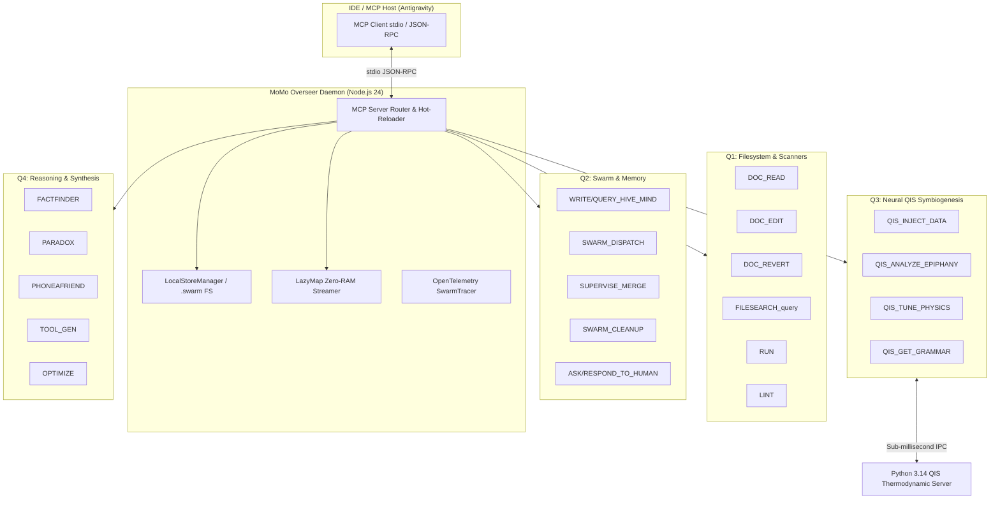

# MoMo Overseer (Antigravity Edition)

[](https://github.com/dewarjoseph/MoMoA-Antigravitish)
[](https://modelcontextprotocol.io/)
[](https://www.typescriptlang.org/)
[](https://nodejs.org/)
[](https://opensource.org/licenses/Apache-2.0)
[](https://github.com/dewarjoseph/QIS)

**MoMo Overseer** is an autonomous, headless CLI daemon and [Model Context Protocol (MCP)](https://modelcontextprotocol.io/) server built to orchestrate multi-agent developer swarms, quantum inference symbiogenesis, and self-healing coding crucibles over local development environments.

---

## 🏛️ System Architecture



---

## 🚀 Key Innovations

1. **Zero-RAM Footprint (`LazyMap`):** A custom virtual map extending V8 collections that resolves files on-demand directly from disk. Large monolithic repositories are indexed in milliseconds without loading megabytes of file contents into memory, eliminating V8 heap exhaustion.
2. **Autonomous Multi-Turn Self-Healing:** Integrated error classification engine detecting syntax errors, missing variables, type mismatches, and test crashes. Automatically triggers reasoning refinement loops and code patches until all assertions pass.
3. **Quantum Inference Symbiogenesis (QIS Integration):** Sub-millisecond cross-process IPC connecting Node.js to Python 3.14 PyTorch continuous thermodynamic glass neural networks. Computes Gaussian Unitary Ensemble (GUE) and Gaussian Orthogonal Ensemble (GOE) Wigner-Dyson spectral rigidity metrics on live latent embeddings.
4. **Bi-Directional Hot-Pluggable MCP Hub:** Connects seamlessly to external MCP servers (`sequential-thinking`, `chrome-devtools`, `tuya-smart-plug`) while acting as a host providing 43+ native tool capabilities.

---

## 🛠️ Complete Tool Directory (43 Native Tools)

| Tool Name | Quadrant | Primary Function |
|---|:---:|---|
| `DOC_READ` | **Q1** | Reads local files with zero-RAM lazy streaming and token summaries. |
| `DOC_EDIT` | **Q1** | Executes surgical search-and-replace multi-block diff edits. |
| `DOC_REVERT` | **Q1** | Reverts tracked files to pristine baseline states. |
| `FILESEARCH_query` | **Q1** | Performs high-speed content and regex searches across codebase. |
| `MOVE_FILE_OR_FOLDER_SOURCE` | **Q1** | Relocates and renames files or directories within workspace. |
| `RUN` | **Q1** | Runs isolated multi-language code snippets (Python, Rust, Node.js). |
| `LINT` | **Q1** | Executes TypeScript/ESLint and Flake8 with platform auto-resolution. |
| `REGEX_VALIDATE` | **Q1** | Validates regular expressions with comprehensive test matrices. |
| `URL_FETCH` | **Q1** | Retrieves web documentation and research articles. |
| `RESTART_PROJECT` | **Q1** | Triggers clean context resets with validation guidance. |
| `WRITE_HIVE_MIND` | **Q2** | Persists gold-standard architectural memory triplets. |
| `QUERY_HIVE_MIND` | **Q2** | Performs vector and cosine ranking memory retrieval. |
| `GET_MEMORY_STATS` | **Q2** | Monitors V8 heap usage, physical memory, and indexed files. |
| `UPDATE_RESEARCH_LOG` | **Q2** | Appends structured markdown progress logs to `RESEARCH_LOG.md`. |
| `SWARM_DISPATCH` | **Q2** | Spawns autonomous parallel worker tasks. |
| `SWARM_STATUS` | **Q2** | Tracks live status of distributed swarm sessions. |
| `SUPERVISE_MERGE` | **Q2** | Evaluates proposed subagent diffs with safety validation. |
| `SWARM_CLEANUP` | **Q2** | Cleans up completed swarm tracking files and artifacts. |
| `ASK_HUMAN` | **Q2** | Submits Human-In-The-Loop (HITL) questions with priority tags. |
| `RESPOND_TO_HUMAN` | **Q2** | Answers pending HITL requests and transitions state. |
| `HITL_STATUS` | **Q2** | Reports pending and historical HITL request queues. |
| `TELEMETRY_DASHBOARD` | **Q2** | Inspects OpenTelemetry distributed trace spans. |
| `QIS_INJECT_DATA` | **Q3** | Injects 384-dim semantic embeddings into the thermodynamic network. |
| `QIS_ANALYZE_EPIPHANY` | **Q3** | Computes Wigner-Dyson level spacings and GUE/GOE KL divergences. |
| `QIS_TUNE_PHYSICS` | **Q3** | Dynamically tunes disorder, pink noise, and thermal cooling rates. |
| `QIS_GET_GRAMMAR` | **Q3** | Extracts collapsed emergent semantic grammar from cold nodes. |
| `QIS_MANAGE_SERVER` | **Q3** | Controls thermodynamic server lifecycle and state resets. |
| `FACTFINDER` | **Q4** | Multi-turn grounded fact retrieval across web and codebase. |
| `PARADOX` | **Q4** | Synthesizes complex architectural conflicts and trade-offs. |
| `PHONEAFRIEND` | **Q4** | Consults specialized expert personas on theoretical problems. |
| `OPTIMIZE` | **Q4** | Conducts Bayesian and random grid search parameter optimization. |
| `TOOL_GEN` | **Q4** | Dynamically compiles and registers sandboxed runtime tools. |
| `TOOL_EVOLVE` | **Q4** | Evolves prompt engineering templates with feedback scoring. |
| `SEARCH_MCP_REGISTRY` | **Q4** | Queries external MCP server registries for capabilities. |
| `list_available_tools` | **Meta** | Enumerates all 43 active MCP tools and parameters. |

---

## 📦 Getting Started

### 1. Installation
```bash
git clone https://github.com/dewarjoseph/MoMoA-Antigravitish.git
cd MoMoA-Antigravitish
npm install
npm run build
```

### 2. Run Test Suite
```bash
npm test
```

### 3. Configure Antigravity / Claude Desktop MCP
Add to your `mcp_servers.json`:
```json
{
  "mcpServers": {
    "momo-overseer": {
      "command": "node",
      "args": [
        "C:/Users/Joe/source/MoMoA-Antigravitish/dist/cli.js",
        "daemon"
      ],
      "env": {
        "MOMO_WORKING_DIR": "C:/Users/Joe/source/MoMoA-Antigravitish"
      }
    }
  }
}
```

---

## 📄 License

Licensed under the [Apache-2.0 License](LICENSE).
